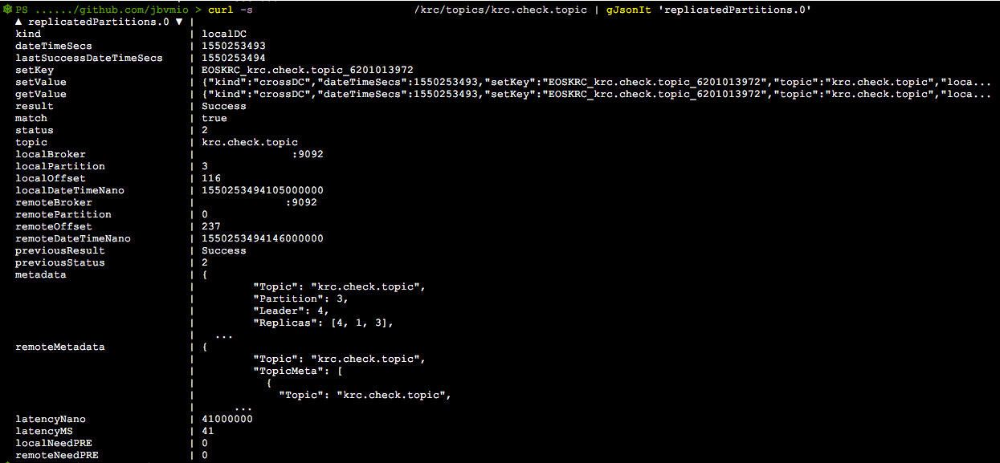

# krc - Kafka Replication Check
* kafkacheck sends a message to all partitions of a given topic and verifies delivery of that message.
* Primarily used to verify replication between Kafka clusters for a topic.
* All parameters and configuration done using config file.
* Launches an API for Mgmt and Status Queries.
* Topic names must match for now on both clusters.
* *Note: PeerBrokers are used if krc is running on another Kafka cluster that replicates to the same Remote Brokers.




### example config .yaml:
```
dataDir: "./krcdb"
dedicatedTopic: "krc.check.topic"
localBrokers:
- local-dc01-kafka01:9092
- local-dc01-kafka02:9092
- local-dc01-kafka03:9092
- local-dc01-kafka04:9092
- local-dc01-kafka05:9092
remoteBrokers:
- remote-dc-kafka01:9092
- remote-dc-kafka02:9092
- remote-dc-kafka03:9092
- remote-dc-kafka04:9092
- remote-dc-kafka05:9092
peerBrokers:
- local-dc02-kafka01:9092
- local-dc02-kafka02:9092
- local-dc02-kafka03:9092
- local-dc02-kafka04:9092
- local-dc02-kafka05:9092
localBootstrap:
remoteBootstrap:
checkKey: KRC_
checkInterval: 10m
retryInterval: 20s
updateInterval: 90m
timeout: 15s
minOffset: 100
blacklistRegex: "_.*|^connect-.*"
whitelistRegex: "^important.topic$"
whitelist:
- whitelisted.topic
- my.topic.here
blacklist:
- __consumer_offsets
- helloworld
apiEndpoint: ":8080"
```

# Using a dedicated topic 
* Specifying a dedicated topic in the config appends that topic in addition to any other topic matched using either white/black list or regex. 

### White/Black Lists
* Blacklists override or wins over Whitelists.

### API Endpoints:
```
/krc
/krc/health
/krc/stop
/krc/runcheck
/krc/update
/krc/status
/krc/checks
/krc/topics
/krc/topics/{topicName}

/xkrc
/xkrc/health
/xkrc/restartcg
/xkrc/resetparts
/xkrc/status
/xkrc/topics
/xkrc/topics/{topicName}

```

## Sample output for a successful Replicated Partition Check:
```
{
  "dateTimeSecs": 1547678573,
  "setKey": "3095357146",
  "setValue": "da2ff93153a78fbf93e7e1f5683b2b2cd3ee4a89",
  "getValue": "da2ff93153a78fbf93e7e1f5683b2b2cd3ee4a89",
  "result": "Success",
  "match": true,
  "status": 2,
  "topic": "krc.check.topic",
  "localBroker": "local-dc01-kafka01:9092",
  "localPartition": 1,
  "localOffset": 23,
  "localDateTimeNano": 1547678576502000000,
  "remoteBroker": "remote-dc01-kafka01:9092",
  "remotePartition": 11,
  "remoteOffset": 30,
  "remoteDateTimeNano": 1547678576549000000,
  "previousResult": "Initializing",
  "previousStatus": 1,
  "metadata": {
    "Topic": "krc.check.topic",
    "Partition": 1,
    "Leader": 1,
    "Replicas": [1, 4, 2],
    "ISRs": [4, 2, 1],
    "OfflineReplicas": null
  },
  "remoteMetadata": {
    "Topic": "krc.check.topic",
    "TopicMeta": [
      {
        "Topic": "krc.check.topic",
        "Partition": 8,
        "Leader": 5,
        "Replicas": [5, 1, 2],
        "ISRs": [1, 2, 5],
        "OfflineReplicas": null
      },
      {
        "Topic": "krc.check.topic",
        "Partition": 11,
        "Leader": 3,
        "Replicas": [3, 5, 1],
        "ISRs": [1, 3, 5],
        "OfflineReplicas": null
      },
      {
        "Topic": "krc.check.topic",
        "Partition": 2,
        "Leader": 4,
        "Replicas": [4, 3, 5],
        "ISRs": [3, 5, 4],
        "OfflineReplicas": null
      },
      {
        "Topic": "krc.check.topic",
        "Partition": 5,
        "Leader": 2,
        "Replicas": [2, 3, 4],
        "ISRs": [3, 4, 2],
        "OfflineReplicas": null
      },
      {
        "Topic": "krc.check.topic",
        "Partition": 14,
        "Leader": 1,
        "Replicas": [1, 3, 4],
        "ISRs": [1, 3, 4],
        "OfflineReplicas": null
      },
      {
        "Topic": "krc.check.topic",
        "Partition": 4,
        "Leader": 1,
        "Replicas": [1, 5, 2],
        "ISRs": [1, 2, 5],
        "OfflineReplicas": null
      },
      {
        "Topic": "krc.check.topic",
        "Partition": 13,
        "Leader": 5,
        "Replicas": [5, 2, 3],
        "ISRs": [2, 3, 5],
        "OfflineReplicas": null
      },
      {
        "Topic": "krc.check.topic",
        "Partition": 7,
        "Leader": 4,
        "Replicas": [4, 5, 1],
        "ISRs": [1, 5, 4],
        "OfflineReplicas": null
      },
      {
        "Topic": "krc.check.topic",
        "Partition": 1,
        "Leader": 3,
        "Replicas": [3, 2, 4],
        "ISRs": [2, 3, 4],
        "OfflineReplicas": null
      },
      {
        "Topic": "krc.check.topic",
        "Partition": 10,
        "Leader": 2,
        "Replicas": [2, 4, 5],
        "ISRs": [5, 4, 2],
        "OfflineReplicas": null
      },
      {
        "Topic": "krc.check.topic",
        "Partition": 9,
        "Leader": 1,
        "Replicas": [1, 2, 3],
        "ISRs": [1, 2, 3],
        "OfflineReplicas": null
      },
      {
        "Topic": "krc.check.topic",
        "Partition": 3,
        "Leader": 5,
        "Replicas": [5, 4, 1],
        "ISRs": [1, 5, 4],
        "OfflineReplicas": null
      },
      {
        "Topic": "krc.check.topic",
        "Partition": 12,
        "Leader": 4,
        "Replicas": [4, 1, 2],
        "ISRs": [1, 2, 4],
        "OfflineReplicas": null
      },
      {
        "Topic": "krc.check.topic",
        "Partition": 6,
        "Leader": 3,
        "Replicas": [3, 4, 5],
        "ISRs": [3, 5, 4],
        "OfflineReplicas": null
      },
      {
        "Topic": "krc.check.topic",
        "Partition": 0,
        "Leader": 2,
        "Replicas": [2, 1, 3],
        "ISRs": [1, 3, 2],
        "OfflineReplicas": null
      }
    ],
    "PartitionOffsets": {
      "0": 25,
      "1": 25,
      "10": 21,
      "11": 30,
      "12": 34,
      "13": 24,
      "14": 27,
      "2": 16,
      "3": 24,
      "4": 24,
      "5": 23,
      "6": 21,
      "7": 15,
      "8": 24,
      "9": 30
    },
    "PartitionLeaders": {
      "0": 2,
      "1": 3,
      "10": 2,
      "11": 3,
      "12": 4,
      "13": 5,
      "14": 1,
      "2": 4,
      "3": 5,
      "4": 1,
      "5": 2,
      "6": 3,
      "7": 4,
      "8": 5,
      "9": 1
    }
  },
  "latencyNano": 47000000,
  "latencyMS": 47,
  "localNeedPRE": 0,
  "remoteNeedPRE": 0
}
```